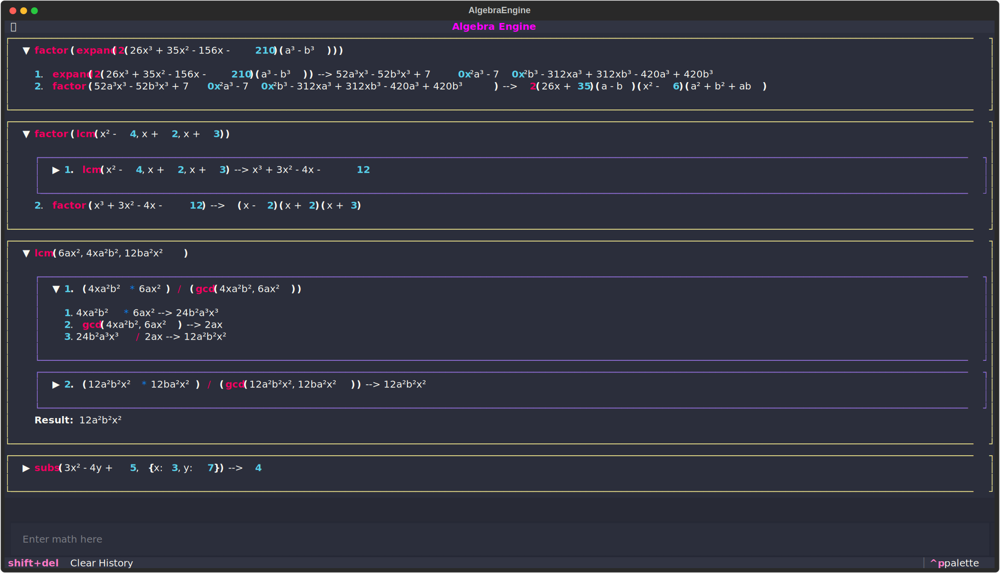
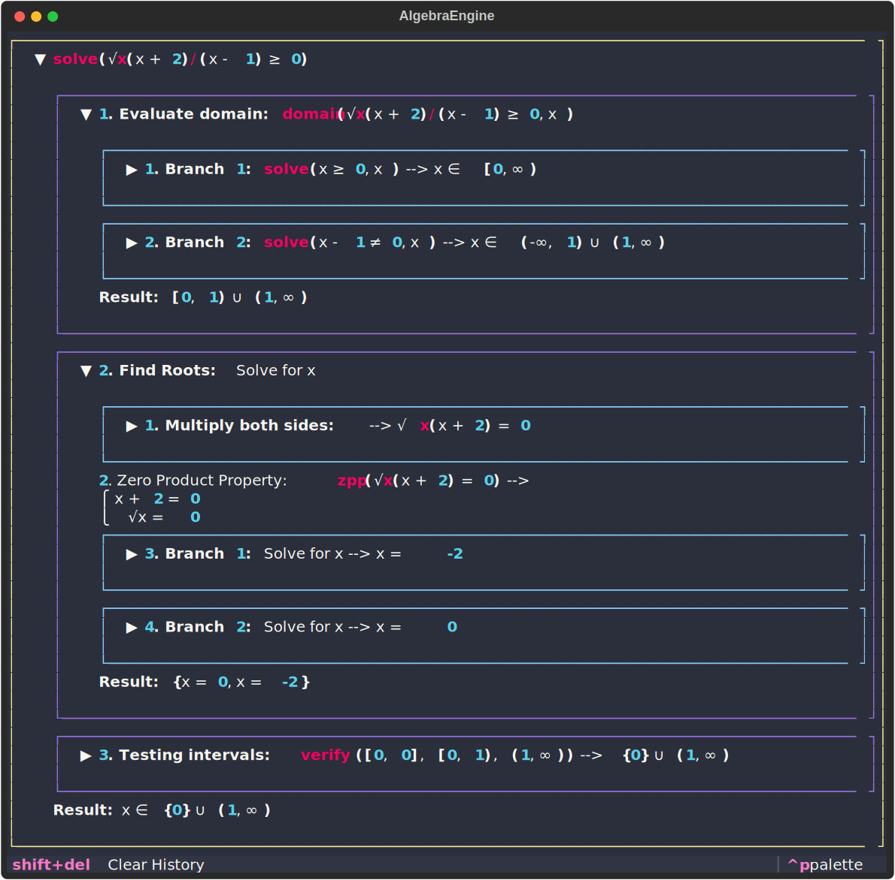
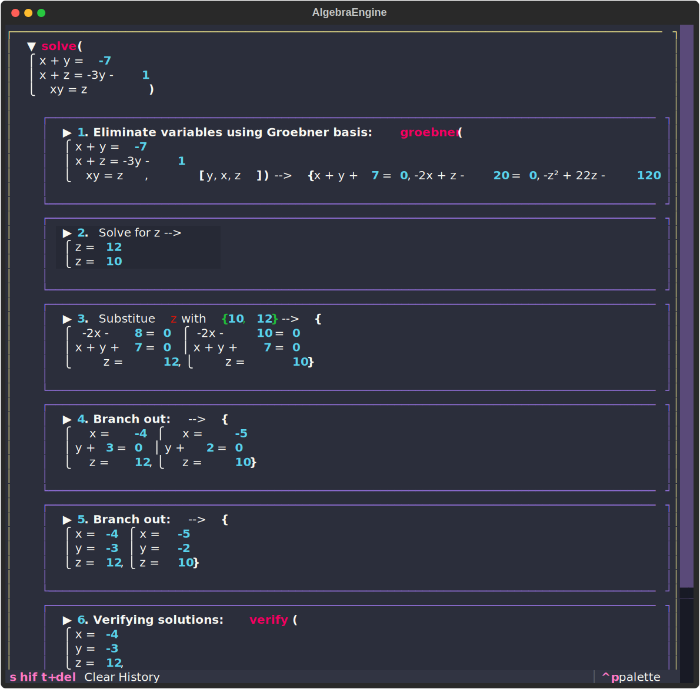

# Algebra Engine 🧮

An educational math software built in Python for manipulating algebraic expressions.
Supports rational simplification, polynomial manipulation, factoring, root finding, equation solving, and many more!

It was initially built as a side project to test my understanding of Algebra II and Pre-Calculus concepts in High School and improve my development skills, but I hope it can be useful to others as well. It is built with a focus on educational value, and it even surpasses its original scope by being able to handle advanced topics like multivariate factoring, high-degree systems of equations, and Groebner bases.

## ✨ Features

- [x] Expression parser (including commands like approx() and solve())
- [x] GCD/LCM computation (numeric and symbolic)
- [x] Exact numeric radical representation
- [x] Expansion and Factoring (numeric and symbolic, univariates & multivariates alike)
- [x] Solving linear and polynomial systems
- [x] Solving equations and inequalities with domain analysis
- [x] Verbose transformation steps with pretty-printer

## Examples


 


## 🚀 Getting Started

Download the latest release executable for your operating system from the [Releases](https://github.com/frusaka/algebra-engine/releases) page.

If you want to run it from source, follow these steps:

1. 📥 Clone the repo:

   ```bash
   git clone https://github.com/frusaka/algebra-engine.git
   cd algebra-engine
   ```

2. 📦 Install dependencies:  
   Ensure that you have [Python 3.10](https://www.python.org/downloads/) or higher installed. Then, create a virtual environment and install the dependencies:

   ```bash
   pip install -r requirements.txt
   ```

3. ▶️ Try it:

   ```bash
   python main.py

   ```

## 🐍 Running Python Code

You can also import the classes and functions and use them in your own code.  
Here are some quick, simple examples to get you started:

```python
from datatypes import Var
x, y = Var("x"), Var("y")
print(x + y - 2)  # prints "x + y - 2"
```

You can also parse expressions from strings:

```python
from parsing import parser
expr = parser.parse("2x + 3 - y")
print(expr)  # prints "2x - y + 3"
```

For more examples or inspirations, check out the tests in the `tests` directory.  
If this project gains traction, I might add more detailed documentation and invite collaborators 😊
